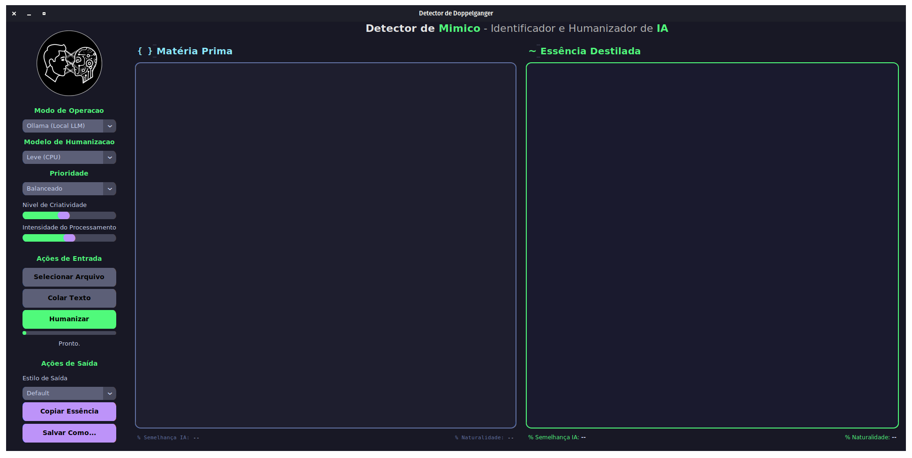

<div align="center">

[](#)
[](https://www.gnu.org/licenses/gpl-3.0)
[](https://www.python.org/)
[](https://github.com/AndreBFarias/Detector-de-Doppelganger/stargazers)
[](https://github.com/AndreBFarias/Detector-de-Doppelganger/issues)

<div style="text-align: center;">
  <h1 style="font-size: 2.2em;">Detector de Doppelganger</h1>
  
</div>

</div>

---

### Descricao

Aplicacao desktop para Linux que detecta e humaniza textos gerados por IA. Arquitetura dual com modos offline (modelos locais) e API (Groq/Gemini). Detector fine-tuned para PT-BR com 100% de acuracia no conjunto de teste.

---

<div align="center">

</div>

---

### Funcionalidades

- **Deteccao de IA:** Modelo fine-tuned para portugues brasileiro (distilbert-multilingual)
- **Humanizacao Multinivel:** Tres niveis de processamento (Leve, Equilibrado, Profundo)
- **Modo Dual:** Operacao offline (local) ou via API (Groq/Gemini)
- **Tecnicas Adversariais:** Substituicao de sinonimos, variacao de estrutura, perturbacao de entropia
- **Avaliacao de Naturalidade:** Score de fluencia usando analise linguistica
- **Multi-formato:** Importa/exporta TXT, DOCX, MD, JSON
- **Interface Moderna:** Tema escuro Dracula com feedback visual em tempo real

---

### Instalacao

**Pre-requisitos:**
- Python 3.10+
- `python3-venv`
- `git`

```bash
git clone https://github.com/AndreBFarias/Detector-de-Doppelganger.git
cd Detector-de-Doppelganger

chmod +x install.sh uninstall.sh

./install.sh
```

O instalador cria ambiente virtual, baixa dependencias e registra atalho no sistema.

**Configuracao API (Opcional):**

Copie `.env.example` para `.env` e configure suas chaves:
```bash
cp .env.example .env
# Edite .env com suas API keys
```

---

### Uso

1. Abra pelo menu de aplicativos ou execute `detectordedoppelganger`
2. Cole texto na caixa esquerda ou importe arquivo
3. Selecione modo de operacao (Local ou API)
4. Ajuste parametros e clique em "Humanizar"
5. Exporte resultado via "Salvar Como..."

---

### Desinstalacao

```bash
cd Detector-de-Doppelganger
./uninstall.sh
```

---

### Stack Tecnica

| Componente | Tecnologia |
|------------|------------|
| Deteccao (Local) | DistilBERT Multilingual (fine-tuned PT-BR) |
| Deteccao (API) | Groq / Gemini |
| Humanizacao (Local) | T5-PTT5 (Unicamp) + Adversarial |
| Humanizacao (API) | Groq (llama-3.3-70b) / Gemini |
| Naturalidade | Lingua Language Detector |
| Interface | CustomTkinter |
| Testes | pytest + pytest-cov |
| Qualidade | ruff + mypy + pre-commit |

---

### Arquitetura

```
├── main.py              # Orquestrador
├── config.py            # Configuracoes centralizadas
├── pyproject.toml       # ruff + mypy + pytest
├── requirements.txt     # Dependencias
├── src/
│   ├── app/             # Bootstrap e inicializacao
│   ├── core/            # Detector, Humanizador, Engine
│   │   └── fine_tuning/ # Scripts de treinamento
│   ├── ui/              # Interface grafica
│   ├── utils/           # Helpers
│   ├── tests/           # Suite de testes (48 testes)
│   └── logs/            # Logs rotacionados
├── models/              # Modelos treinados
├── data/                # Datasets de fine-tuning
├── assets/              # Recursos visuais
├── docs/                # Documentacao tecnica
└── dev-journey/         # Historico de desenvolvimento
```

---

### Fine-Tuning (Opcional)

Para retreinar o detector com seu proprio dataset:

```bash
# 1. Gerar dataset (requer GEMINI_API_KEY)
python -m src.core.fine_tuning.build_balanced_dataset

# 2. Treinar modelo
python -m src.core.fine_tuning.train_detector

# 3. Avaliar
python -m src.core.fine_tuning.evaluate_model
```

---

### Limitacoes

- Deteccao menos precisa em textos curtos (<100 palavras)
- Textos IA formais muito curtos podem ser subdetetados
- Modelos grandes requerem 4GB+ RAM

---

### Licenca

[GPLv3](LICENSE) - Software livre, use e modifique a vontade.

---

<div align="center">
<sub>Desenvolvido por Andre Farias</sub>
</div>
