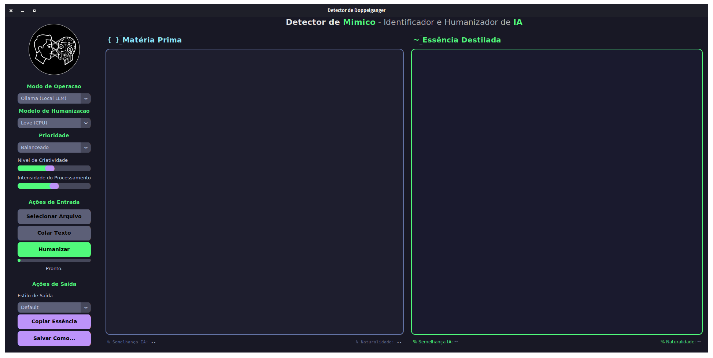

<div align="center">

[](#)
[](https://www.gnu.org/licenses/gpl-3.0)
[](https://www.python.org/)
[](https://github.com/AndreBFarias/Detector-de-Doppelganger/stargazers)
[](https://github.com/AndreBFarias/Detector-de-Doppelganger/issues)

<div style="text-align: center;">
  <h1 style="font-size: 2.2em;">Detector de Doppelganger</h1>
  
</div>

</div>

---

### Descrição

**v1.0** - Aplicação desktop para Linux que detecta e humaniza textos gerados por IA. Suporta três modos de operação: Local (offline), Ollama (LLM local) e API (Groq/Gemini). Detector fine-tuned para PT-BR com alta acurácia. **Novo: Redução de score de IA de até 50% via Ollama.**

---

<div align="center">

</div>

---

### Funcionalidades

- **Detecção de IA:** Modelo fine-tuned para português brasileiro (distilbert-multilingual)
- **Humanização via Ollama:** LLM local (llama3.2, gemma2, phi3) com redução de até 50%
- **Três Modos de Prioridade:** Balanceado, Redução Máxima ou Preservar Conteúdo
- **Modo Triplo:** Operação Local (offline), Ollama (LLM local) ou API (Groq/Gemini)
- **Técnicas Adversariais:** Remoção de marcadores de IA, paráfrase iterativa
- **Avaliação de Naturalidade:** Score de fluência usando análise linguística
- **Multi-formato:** Importa/exporta TXT, DOCX, MD, JSON
- **Interface Moderna:** Tema escuro Dracula com feedback visual em tempo real
- **Pacotes:** Disponível como .deb e .flatpak

---

### Instalação

**Pré-requisitos:**
- Python 3.10+
- `python3-venv`
- `git`

```bash
git clone https://github.com/AndreBFarias/Detector-de-Doppelganger.git
cd Detector-de-Doppelganger

chmod +x install.sh uninstall.sh

./install.sh
```

O instalador cria ambiente virtual, baixa dependências e registra atalho no sistema.

**Configuração API (Opcional):**

Copie `.env.example` para `.env` e configure suas chaves:
```bash
cp .env.example .env
# Edite .env com suas API keys
```

---

### Uso

1. Abra pelo menu de aplicativos ou execute `detectordedoppelganger`
2. Cole texto na caixa esquerda ou importe arquivo
3. Selecione modo de operação (Local ou API)
4. Ajuste parâmetros e clique em "Humanizar"
5. Exporte resultado via "Salvar Como..."

---

### Desinstalação

```bash
cd Detector-de-Doppelganger
./uninstall.sh
```

---

### Stack Técnica

| Componente | Tecnologia |
|------------|------------|
| Detecção (Local) | DistilBERT Multilingual (fine-tuned PT-BR) |
| Humanização (Ollama) | llama3.2, gemma2, phi3 via Ollama |
| Humanização (Local) | Adversarial + Marcadores IA |
| Humanização (API) | Groq (llama-3.3-70b) / Gemini |
| Naturalidade | Lingua Language Detector |
| Interface | CustomTkinter (tema Dracula) |
| Testes | pytest + pytest-cov |
| Qualidade | ruff + mypy + pre-commit |
| Pacotes | .deb + .flatpak |

---

### Arquitetura

```
├── main.py              # Orquestrador
├── config.py            # Configurações centralizadas
├── pyproject.toml       # ruff + mypy + pytest
├── requirements.txt     # Dependências
├── src/
│   ├── app/             # Bootstrap e inicialização
│   ├── core/            # Detector, Humanizador, Engine
│   │   └── fine_tuning/ # Scripts de treinamento
│   ├── ui/              # Interface gráfica
│   ├── utils/           # Helpers
│   ├── tests/           # Suite de testes (48 testes)
│   └── logs/            # Logs rotacionados
├── models/              # Modelos treinados
├── assets/              # Recursos visuais
├── packaging/           # Scripts .deb e .flatpak
└── docs/                # Documentação e histórico
```

---

### Fine-Tuning (Opcional)

Para retreinar o detector com seu próprio dataset:

```bash
# 1. Gerar dataset (requer GEMINI_API_KEY)
python -m src.core.fine_tuning.build_balanced_dataset

# 2. Treinar modelo
python -m src.core.fine_tuning.train_detector

# 3. Avaliar
python -m src.core.fine_tuning.evaluate_model
```

---

### Limitações

- Detecção menos precisa em textos curtos (<100 palavras)
- Textos IA formais muito curtos podem ser subdetectados
- Modelos grandes requerem 4GB+ RAM

---

### Licença

[GPLv3](LICENSE) - Software livre, use e modifique à vontade.

---

<div align="center">
<sub>Projeto Open Source</sub>
</div>
